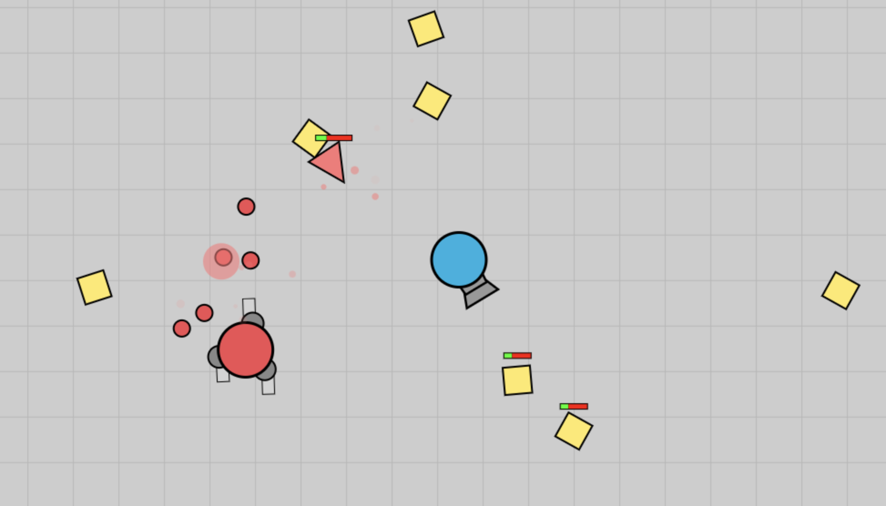
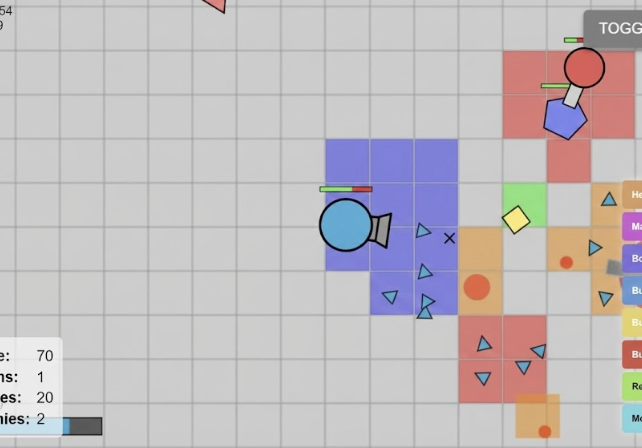
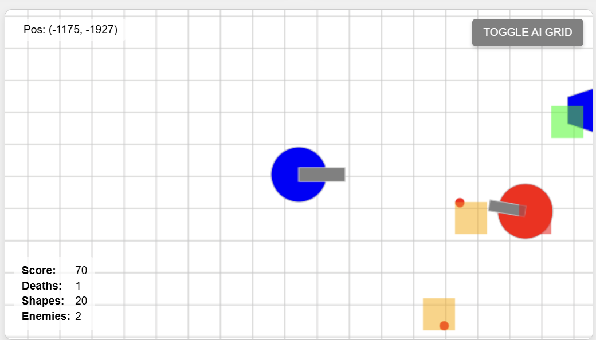
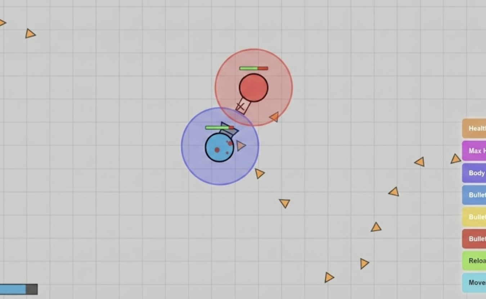
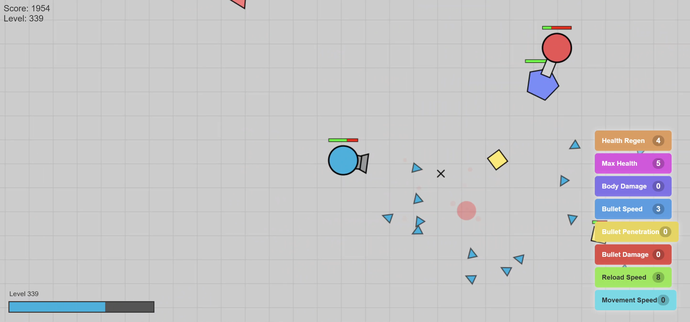
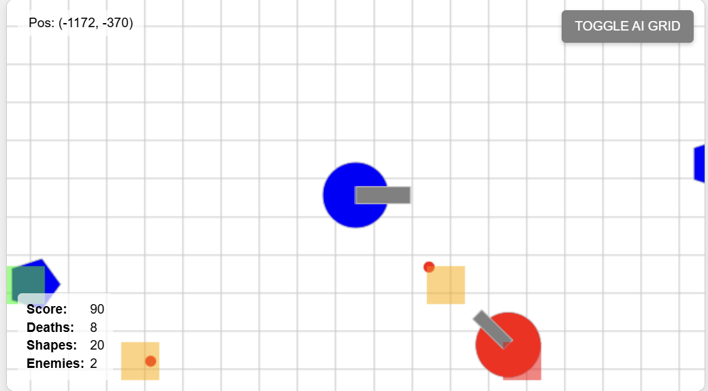

# Deep Q-Network (DQN) AI for Diep.io Clone

A fully functional web-based clone of the popular game *Diep.io*, featuring a custom **Reinforcement Learning (DQN) AI agent**. This project simulates a survival tank shooter where an autonomous agent learns to navigate, farm shapes for XP, upgrade its stats, and combat enemy tanks using a grid-based vision system.



## Table of Contents
* [Overview](#-overview)
* [AI Architecture & Vision](#-ai-architecture--vision)
* [Game Features](#-game-features)
* [Installation & Usage](#-installation--usage)

---

## Overview

This project implements a complete game engine in vanilla JavaScript using the HTML5 Canvas API. The core focus is the integration of a Deep Q-Network (DQN) that controls the "Player" tank. The AI is capable of:
* **Pathfinding:** Avoiding collisions with high-level enemies and bullets.
* **Resource Gathering:** Identifying and destroying shapes (Squares, Triangles, Pentagons) to gain XP.
* **Combat:** Engaging enemy tanks with predictive aiming and recoil management.
* **Stat Management:** Dynamically upgrading stats like *Bullet Penetration*, *Reload Speed*, and *Max Health* based on available skill points.

---

## AI Architecture & Vision

The AI interacts with the game world through a sophisticated state representation system. Instead of receiving raw pixel data, the agent processes a grid-based abstraction of the environment to calculate safety scores and target density.

<table>
  <tr>
    <td width="50%">
      <h3>1. Spatial Awareness Grid</h3>
      <p>The AI divides its surroundings into a dynamic grid. It calculates safety scores for each sector, allowing the agent to make decisions based on local threats rather than processing the entire map at once.</p>
    </td>
    <td width="50%">
      
    </td>
  </tr>
  <tr>
    <td width="50%">
      
    </td>
    <td width="50%">
      <h3>2. Debug Visualization</h3>
      <p>The engine includes a debug mode that visualizes the AI's "thought process." The grid overlays show active sectors, while collision boxes and target vectors are rendered to verify detection logic.</p>
    </td>
  </tr>
    <tr>
    <td width="50%">
      <h3>3. Threat Detection Hierarchy</h3>
      <p>The AI prioritizes targets based on a strict hierarchy:</p>
      <ol>
        <li><strong>Bullets:</strong> Highest priority avoidance.</li>
        <li><strong>Enemy Tanks:</strong> Combat engagement or retreat logic depending on relative health.</li>
        <li><strong>Shapes:</strong> Farming behavior when no immediate threats are present.</li>
      </ol>
    </td>
    <td width="50%">
      
    </td>
  </tr>
</table>

---

## Game Features

This is not just an AI simulation; it is a fully playable game engine faithful to the original *Diep.io* mechanics.

### Upgrade System & Stats
As the AI (or player) destroys shapes and enemies, they gain XP. Leveling up unlocks skill points that can be allocated to 8 distinct attributes to customize the tank build.

<table>
  <tr>
    <td width="33%">
      
      <p align="center"><em>Mid-Game Build</em></p>
    </td>
    <td width="33%">
      
      <p align="center"><em>High-Level Combat</em></p>
    </td>
    <td width="33%">
      
      <p align="center"><em>Stat Distribution</em></p>
    </td>
  </tr>
</table>

### Tank Classes
The game features a wide variety of playable classes, each with unique bullet spawners, recoil physics, and firing patterns. The logic handles specific behaviors for complex classes like the **Auto 3**, **Twin Flank**, and **Trapper**.

* **Standard:** Tank, Twin, Sniper, Machine Gun, Flank Guard.
* **Advanced:** Destroyer, Gunner, Tri-Angle, Quad Tank, Twin Flank, Auto 3, Assassin, Triple Shot, Hunter, Trapper.

---

## Installation & Usage

1.  **Clone the Repository**
    ```bash
    git clone [https://github.com/soyuznik/Reinforcement-Learning-Agent.git](https://github.com/soyuznik/Reinforcement-Learning-Agent.git)
    ```
2.  **Run the Game**
    * Simply open `index.html` in any modern web browser. No backend server or Python dependencies are required for the base game loop.
3.  **Controls**
    * **Movement:** `W`, `A`, `S`, `D` or Arrow Keys.
    * **Aiming:** Mouse Cursor.
    * **Shooting:** Left Mouse Click (Hold).
    * **Toggle AI Grid:** Use the button in the top right corner (if enabled in UI).
